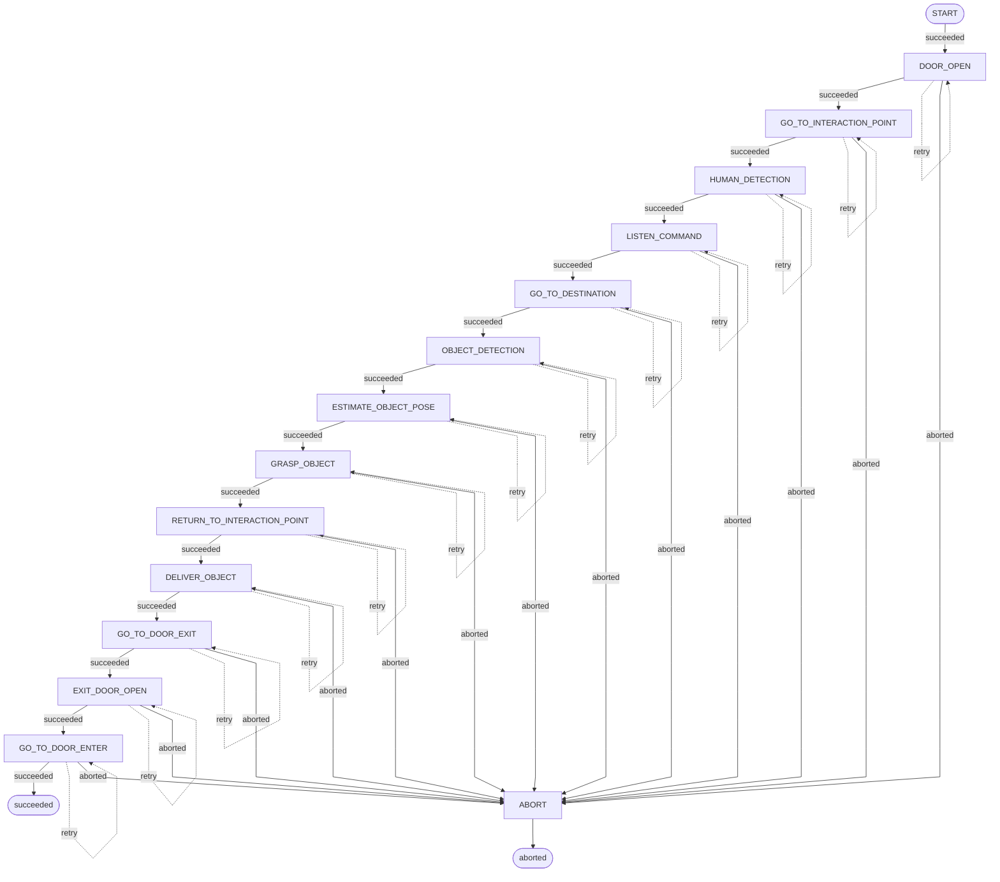
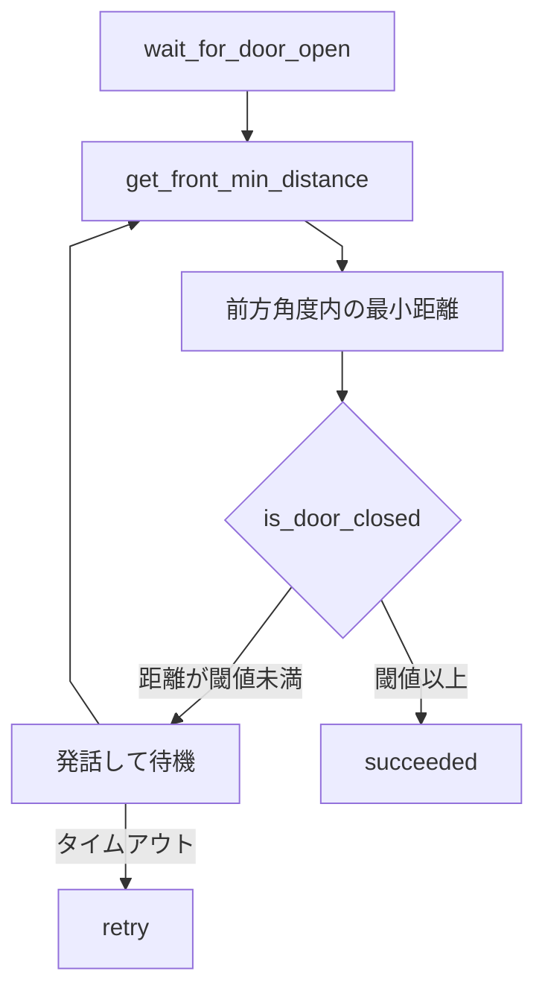
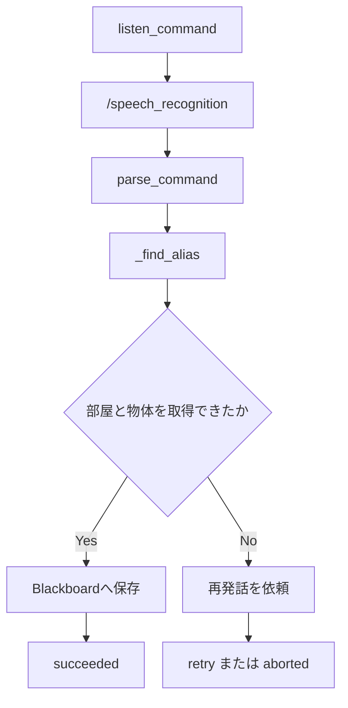
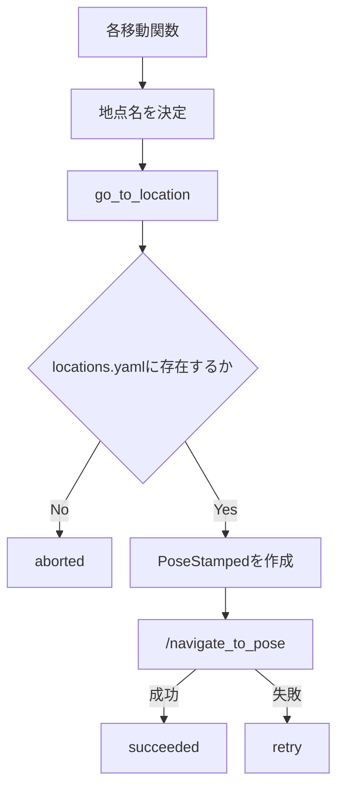
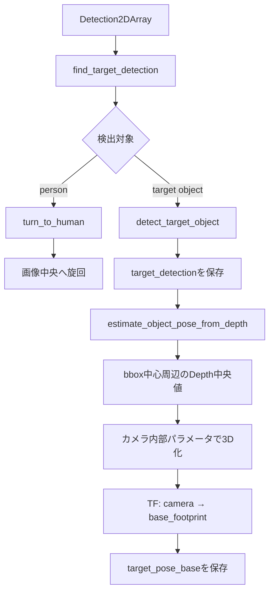
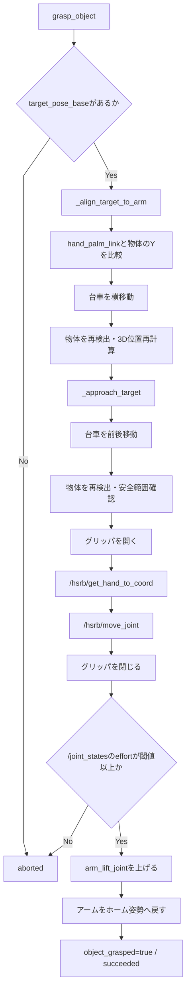
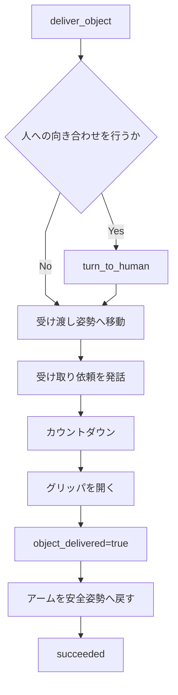
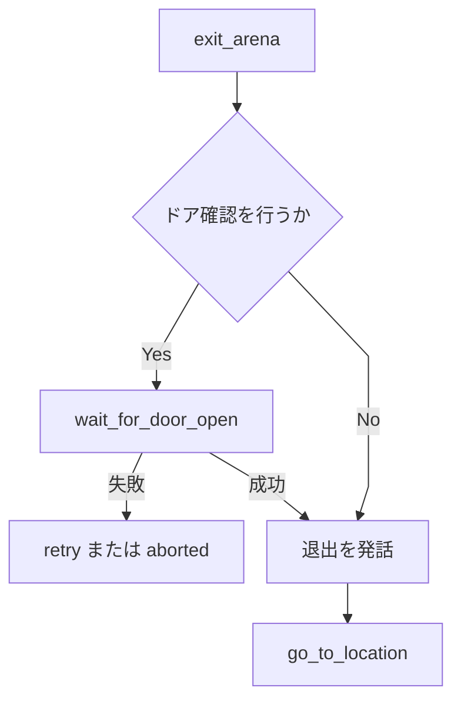

# sobits_open_mine

HSR（Human Support Robot）で「Bring Me」タスクを実行するROS 2パッケージです。
音声で依頼された部屋と物体を認識し、目的地への移動、物体検出、3次元位置推定、把持、操作者への受け渡し、アリーナ退出までを状態機械で順番に実行します。

## 動作の流れ

基本的な状態遷移は次のとおりです。

1. LiDARでドアが開いていることを確認する
2. 操作者との対話地点へ移動する
3. 人を検出する
4. 音声認識で部屋と対象物を取得する
5. 指定された部屋へ移動する
6. YOLOまたはYOLOE Visual Promptで対象物を検出する
7. Depth画像とCameraInfoから対象物の3次元位置を計算する
8. TFで対象位置を`base_footprint`座標系へ変換する
9. 台車とアームの位置を調整して物体を把持する
10. 操作者との対話地点へ戻る
11. 人へ物体を受け渡す
12. 出口へ移動する

## Stateの遷移

`state_machine.py`で定義されている現在の状態遷移です。`succeeded`は次のStateへ進み、`retry`は同じStateを再実行し、`aborted`は`ABORT`へ移動します。



Stateと呼び出される主な`task_actions`関数の対応は次のとおりです。

| State | 呼び出す関数 | 主な処理 |
|---|---|---|
| `DOOR_OPEN` | `wait_for_door_open()` | LiDARで入口ドアの開放を待つ |
| `GO_TO_INTERACTION_POINT` | `go_to_interaction_point()` | 操作者との対話地点へ移動 |
| `HUMAN_DETECTION` | `turn_to_human()` | 人を検出して正面へ向く |
| `LISTEN_COMMAND` | `listen_command()` | 音声指示から部屋と物体を取得 |
| `GO_TO_DESTINATION` | `go_to_destination()` | 指定された部屋へ移動 |
| `OBJECT_DETECTION` | `detect_target_object()` | 対象物の2D bboxを取得 |
| `ESTIMATE_OBJECT_POSE` | `estimate_object_pose_from_depth()` | bboxとDepthから3D位置を取得 |
| `GRASP_OBJECT` | `grasp_object()` | 台車とアームを調整して把持 |
| `RETURN_TO_INTERACTION_POINT` | `return_to_interaction_point()` | 操作者との対話地点へ戻る |
| `DELIVER_OBJECT` | `deliver_object()` | 人へ向き、グリッパを開いて受け渡す |
| `GO_TO_DOOR_EXIT` | `go_to_door_exit()` | 出口ドア手前へ移動 |
| `EXIT_DOOR_OPEN` | `wait_for_door_open()` | LiDARで出口ドアの開放を待つ |
| `GO_TO_DOOR_ENTER` | `go_to_door_enter()` | ドアを通過して最終地点へ移動 |
| `ABORT` | `stop_robot()` | 台車を停止して異常終了 |

`EXIT_ARENA` Stateと`exit_arena()`も実装・登録されていますが、現在の通常遷移には接続されていません。現在の退出処理は`GO_TO_DOOR_EXIT`、`EXIT_DOOR_OPEN`、`GO_TO_DOOR_ENTER`の3 Stateで実行されます。

## task_actionsの詳細

各項目はクリックすると展開できます。先頭が`_`の関数は、同じモジュール内や関連処理から使われる内部補助関数です。

<details>
<summary><code>door.py</code>：LiDARによるドア開閉判定</summary>



| 関数 | 説明 |
|---|---|
| `get_front_min_distance()` | `/scan`からロボット前方の指定角度内にある有効な距離を抽出し、最小値を返す |
| `is_door_closed()` | 前方最小距離と`closed_distance_threshold`を比較する。LaserScanがない場合は安全側として閉状態とする |
| `wait_for_door_open()` | 「ドアを開けてください」と発話し、ROSをspinしながら開放を待つ。開けば`succeeded`、時間切れなら`retry`を返す |

</details>

<details>
<summary><code>speech.py / command_parser.py</code>：音声指示の取得と解析</summary>



| 関数・クラス | 説明 |
|---|---|
| `ParsedCommand` | 認識文、対象物、部屋、目的地点、YOLOラベルをまとめるデータクラス |
| `_find_alias()` | 正規化した認識文に、`task_params.yaml`の部屋・物体の別名が含まれるか調べる |
| `parse_command()` | 認識文をルールベースで解析し、部屋、物体、地点、YOLOラベルを生成する |
| `listen_command()` | 発話で指示を求め、STT Actionを実行し、解析結果をBlackboardへ保存する |

`listen_command()`が主に更新するBlackboardキーは`command_text`、`target_room`、`target_object`、`destination_location`、`yolo_target_labels`です。

</details>

<details>
<summary><code>navigate.py</code>：Nav2による地点移動</summary>



| 関数 | 説明 |
|---|---|
| `go_to_location()` | 地点名を`locations`から検索し、`PoseStamped`を生成してNav2へ送る共通関数 |
| `go_to_interaction_point()` | `navigation.interaction_location`で指定した操作者との対話地点へ移動する |
| `go_to_destination()` | Blackboardの`destination_location`、または`target_room`から目的地点を決めて移動する |
| `return_to_interaction_point()` | 把持後の受け渡しのため対話地点へ戻る |
| `go_to_door_exit()` | `exit_arena.exit_location`で指定した出口ドア手前へ移動する |
| `go_to_door_enter()` | `exit_arena.door_enter_location`で指定したドア通過後の地点へ移動する |

移動目標はBlackboardの`last_nav_goal`へ保存されます。

</details>

<details>
<summary><code>perception.py</code>：人・物体検出と3次元位置推定</summary>



| 関数 | 説明 |
|---|---|
| `get_detection_label()` | `Detection2D`からクラス名を取得する |
| `get_detection_score()` | 検出信頼度を取得する |
| `get_bbox_center_xy()` / `get_bbox_center_x()` | bboxの中心ピクセルを取得する |
| `get_bbox_size()` | bboxの幅と高さを取得する |
| `label_matches()` | 検出ラベルが対象ラベル一覧と一致するか確認する |
| `find_target_detection()` | ラベルと信頼度条件を満たす検出のうち、最もスコアが高いものを選ぶ |
| `detection_to_dict()` | ROSメッセージをBlackboardへ保存しやすい辞書へ変換する |
| `turn_to_human()` | 人のbbox中心と画像中心の差から台車を旋回し、人を正面に捉える |
| `look_down_for_object()` | 物体探索前に頭部関節を指定角度へ動かす |
| `detect_target_object()` | YOLO結果から対象物を探し、`target_detection`へ保存する |
| `_read_depth_value_m()` | `16UC1`または`32FC1`のDepth画像から1画素の距離をメートルで読む |
| `_median_depth_around()` | bbox中心周辺の有効Depth値の中央値を求め、ノイズの影響を抑える |
| `estimate_object_pose_from_depth()` | bbox中心、Depth、CameraInfoから3D点を計算し、TF変換後の座標を保存する |

</details>

<details>
<summary><code>grasp.py</code>：台車・アーム・グリッパによる把持</summary>



| 関数 | 説明 |
|---|---|
| `_cfg()` | Blackboardの`task_params.grasp`を取得する |
| `_to_bool()` | YAMLなどから取得した値をboolへ変換する |
| `_set_failure()` | 失敗段階とメッセージをBlackboardへ保存する |
| `_move_pose()` | HSRB Libraryの登録姿勢Actionを呼び出す |
| `_move_joint()` | 指定した関節名と角度をHSRB Libraryへ送る |
| `_sec_to_duration()` | 秒をROSの`Duration`メッセージへ変換する |
| `_publish_gripper_trajectory()` | グリッパ関節の軌道指令をPublishする |
| `_open_gripper()` / `_close_gripper()` | 設定値を使ってグリッパを開閉し、動作完了を待つ |
| `_ensure_effort_subscription()` | `/joint_states`の指関節effortを保存するSubscriptionを準備する |
| `_is_object_grasped()` | 左右の指関節effortが閾値以上か判定する |
| `_wait_for_grasp_confirmation()` | effortが指定回数連続で閾値を超えるまで待つ |
| `_get_omni_publisher()` | 横移動に使う`cmd_vel` Publisherを取得・生成する |
| `_publish_omni_velocity()` / `_stop_omni()` | 全方向台車の速度指令送信と停止を行う |
| `_get_arm_center_y()` | TFから`hand_palm_link`のY座標を取得する |
| `_move_laterally_once()` | 時間制御の`cmd_vel`で台車を左右へ移動する |
| `_align_target_to_arm()` | 対象物とアームの横位置を合わせ、再検出結果を確認する |
| `_safe_check()` | 対象物のx、y、zが把持可能な安全範囲内か確認する |
| `_refresh_target_pose()` | 古い検出結果を消し、物体検出と3D位置推定を再実行する |
| `_rotate_with_cmd_vel()` | HSRB Libraryで旋回できなかった場合の時間制御フォールバック |
| `_face_target()` | 対象物の方向へ台車を旋回する補助関数。現在の主把持フローからは呼ばれていない |
| `_move_forward_with_cmd_vel()` | HSRB Libraryで直進できなかった場合の時間制御フォールバック |
| `_approach_target()` | 物体との前後距離を調整し、再検出後の誤差を確認する |
| `_return_arm_home()` | 把持後にアームを安全なホーム姿勢へ戻す |
| `_hsrb_library_grasp()` | 横位置合わせから把持確認、持ち上げまでを順番に実行する内部本体 |
| `grasp_object()` | Stateから呼ばれる入口。結果と`grasp_plan`をBlackboardへ保存する |

</details>

<details>
<summary><code>handover.py</code>：操作者への物体受け渡し</summary>



| 関数 | 説明 |
|---|---|
| `_handover_cfg()` | `task_params.handover`を取得する |
| `_grasp_cfg()` | グリッパ開放設定として`task_params.grasp`を取得する |
| `_move_to_handover_pose()` | YAMLで指定された受け渡し姿勢へアームを動かす |
| `_return_after_handover()` | 受け渡し後にアームを安全姿勢へ戻す |
| `deliver_object()` | 人への向き合わせ、発話、カウントダウン、グリッパ開放をまとめて実行する |

</details>

<details>
<summary><code>exit_arena.py</code>：ドア確認とアリーナ退出をまとめた処理</summary>



| 関数 | 説明 |
|---|---|
| `exit_arena()` | 出口ドアの開放待ち、退出発話、出口地点への移動を1つにまとめた関数 |

この関数に対応する`EXIT_ARENA` Stateは存在しますが、現在の通常State遷移からは呼ばれません。

</details>

## 前提

- ROS 2 Jazzy
- HSR実機または対応するシミュレーション環境
- `sobits_open_ws`がビルド済みであること
- HSRのセンサー、TF、コントローラーが利用可能であること
- 地図が作成済みで、`locations.yaml`の座標が地図と一致していること

初回またはソース変更後はワークスペースをビルドします。

```bash
cd ~/sobits_open_ws
source /opt/ros/jazzy/setup.bash
colcon build --symlink-install
source install/setup.bash
```

## 起動方法

### 1. 関連ノードの一括起動

ワークスペース直下から起動スクリプトを実行します。

```bash
cd ~/sobits_open_ws
chmod +x start_bring_me_tabs.sh  # 初回のみ
./start_bring_me_tabs.sh
```

このスクリプトはGNOME Terminalのタブを作成し、次のシステムを起動します。

| タブ | 起動するシステム | 役割 |
|---|---|---|
| TTS | `sobits_tts` | 発話 |
| Whisper | `sobits_speech_recognition` | 音声認識 |
| Nav2 | `sobits_nav` | 自律移動 |
| YOLO | `yolo_ros` | 物体・人物の2次元検出 |
| HSRB Library | `hsrb_library` | 台車・関節・手先の制御 |

各タブでは`~/sobits_open_ws/install/setup.bash`を読み込み、`hsrb_mode`を実行してからノードを起動します。

### 2. 地図上の初期位置設定

RVizの`2D Pose Estimate`を使い、表示されている地図とLiDARの点群が重なるようにロボットの初期姿勢を設定します。

位置だけでなくロボットの向きも合わせてください。地図とLiDARがずれている状態では、Nav2による移動が失敗したり、誤った経路を生成したりする可能性があります。

### 3. Bring Meタスクの開始

新しいターミナルで次を実行します。

```bash
cd ~/sobits_open_ws
source install/setup.bash
hsrb_mode
ros2 run sobits_open_mine bring_me_node --enable-nav
```

`--enable-nav`を付けない場合、直接実行時のナビゲーションは無効になるため注意してください。

対象物をあらかじめ指定する場合は、次のように実行できます。

```bash
ros2 run sobits_open_mine bring_me_node --enable-nav --target-object sponge
```

状態を限定して確認する場合は、`--skip-states`にスキップする状態名を指定できます。

```bash
ros2 run sobits_open_mine bring_me_node \
  --target-object sponge \
  --skip-states DOOR_OPEN NAVIGATE_TO_INTERACTION_POINT HUMAN_DETECTION
```

## Launchファイルによる起動

`bring_me_system.launch.py`から関連システムをまとめて起動することもできます。

```bash
ros2 launch sobits_open_mine bring_me_system.launch.py \
  robot:=hsrb \
  skip_profile:=none
```
※一気にlaunchを建てると不具合が起きるので使用しません（今後改善したいと思います）
起動対象は`config/launch_arg.yaml`で切り替えます。現在の設定では`bring_me_node.enabled`と`yoloe_visual_prompt_node.enabled`が`false`です。Launchファイルだけで一連の動作を開始する場合は、必要な項目を`true`にしてください。


## YOLOE Visual Prompt

通常のYOLOクラスでは検出しにくい物体を、参照画像と画像内の矩形領域から検出する機能です。

### 参照画像の準備

参照画像を`visual_prompts/`へ保存します。例えばスポンジの場合は次の配置にします。

```text
visual_prompts/
├── sponge.jpg
└── sponge.bbox.yaml
```

マウスで参照物体の範囲を選択します。

```bash
cd ~/sobits_open_ws
source install/setup.bash
ros2 run sobits_open_mine visual_prompt_selector \
  --image src/sobits_open_mine/visual_prompts/sponge.jpg
```

選択すると、画像と同じ場所に`sponge.bbox.yaml`が生成されます。矩形は元画像のピクセル座標を使った`[x1, y1, x2, y2]`形式です。

ファイル追加後は再ビルドします。

```bash
colcon build --packages-select sobits_open_mine --symlink-install
source install/setup.bash
```

### Visual Promptの有効化

`config/yoloe_visual_prompt.yaml`で参照画像などを設定します。

```yaml
prompt_image_path: visual_prompts/sponge.jpg
prompt_bbox: [0.0, 0.0, 0.0, 0.0]
target_class_name: object
text_prompt_classes: [person]
```

`prompt_bbox`をすべて`0.0`にすると、画像と同名の`.bbox.yaml`が自動的に読み込まれます。`person`は人検出を同時に行うためのテキストプロンプトです。

続いて`config/launch_arg.yaml`を変更します。

```yaml
yoloe_visual_prompt_node:
  enabled: true
```

Visual Promptが有効な場合は通常のYOLOを二重起動せず、`bring_me_node`の物体検出と人検出の入力が`/yoloe/object_boxes`へ切り替わります。

## 使用するAction

| Action名 | 型 | 用途 |
|---|---|---|
| `/speech_word` | `sobits_interfaces/action/TextToSpeech` | ロボットの発話 |
| `/speech_recognition` | `sobits_interfaces/action/SpeechRecognition` | 音声コマンドの認識 |
| `/navigate_to_pose` | `nav2_msgs/action/NavigateToPose` | 地図上の目的地への移動 |
| `/hsrb/move_to_pose` | `sobits_interfaces/action/MoveToPose` | HSRの登録済み姿勢への移動 |
| `/hsrb/move_joint` | `sobits_interfaces/action/MoveJoint` | 関節角度の指定 |
| `/hsrb/move_wheel_linear` | `sobits_interfaces/action/MoveWheelLinear` | 台車の直進移動 |
| `/hsrb/move_wheel_rotate` | `sobits_interfaces/action/MoveWheelRotate` | 台車の旋回 |

## 使用するService

| Service名 | 型 | 用途 |
|---|---|---|
| `/hsrb/get_hand_to_coord` | `sobits_interfaces/srv/GetHandToTargetCoord` | 目標座標へ手先を動かすための関節角度を取得 |
| `/hsrb/get_hand_to_tf` | `sobits_interfaces/srv/GetHandToTargetTF` | 目標TFへ手先を動かすための情報を取得 |

現在の把持処理では主に`/hsrb/get_hand_to_coord`を使用します。

## 使用するTopic

| Topic名 | 型 | 入出力 | 用途 |
|---|---|---|---|
| `/scan` | `sensor_msgs/msg/LaserScan` | Subscribe | ドア開閉判定と周辺距離の取得 |
| `/head_rgbd_sensor/rgb/image_rect_color` | `sensor_msgs/msg/Image` | YOLO入力 | 通常の物体・人物検出 |
| `/head_rgbd_sensor/rgb/image_raw` | `sensor_msgs/msg/Image` | Subscribe | Visual Promptの画像入力（設定で変更可能） |
| `/yolo_node/object_boxes` | `vision_msgs/msg/Detection2DArray` | Subscribe | 通常YOLOの検出結果 |
| `/yoloe/object_boxes` | `vision_msgs/msg/Detection2DArray` | Publish/Subscribe | Visual Promptの検出結果 |
| `/head_rgbd_sensor/depth_registered/image_raw` | `sensor_msgs/msg/Image` | Subscribe | 対象物までのDepth取得 |
| `/head_rgbd_sensor/rgb/camera_info` | `sensor_msgs/msg/CameraInfo` | Subscribe | 2D座標から3D座標への変換 |
| `/omni_base_controller/cmd_vel` | `geometry_msgs/msg/Twist` | Publish | 人への向き合わせと把持前の台車微調整 |
| `/gripper_controller/joint_trajectory` | `trajectory_msgs/msg/JointTrajectory` | Publish | グリッパの開閉 |
| `/joint_states` | `sensor_msgs/msg/JointState` | Subscribe | 指のeffortによる把持成功判定 |

Topic名は主に`config/robot.yaml`で変更できます。

## TF

物体検出では、Depth画像から求めたカメラ座標系の3次元点をTFで`base_footprint`へ変換します。把持時には`base_footprint`から`hand_palm_link`の位置も参照し、対象物とアームの横位置を合わせます。

そのため、カメラフレーム、`base_footprint`、`hand_palm_link`間のTFが配信されている必要があります。

## Blackboardが管理する情報

Blackboardは、状態機械の各処理間で結果を共有するための一時的なメモリです。YAMLが固定設定を保持するのに対し、Blackboardは実行中に変化する値を保持します。

| キー | 内容 |
|---|---|
| `locations` | `locations.yaml`から読み込んだ地点情報 |
| `task_params` | `task_params.yaml`から読み込んだ動作設定 |
| `skip_states` | 実行しない状態の集合 |
| `command_text` | 音声認識結果 |
| `target_room` | 音声から抽出した部屋名 |
| `target_object` | 探索・把持する物体名 |
| `destination_location` | 移動先に対応する地点名 |
| `yolo_target_labels` | 対象物として許可するYOLOラベル一覧 |
| `human_detected` | 人検出の成否 |
| `last_nav_goal` | 最後に指定したナビゲーション目標 |
| `target_detection` | 選択された2次元検出結果 |
| `target_pose_camera` | カメラ座標系での物体3次元位置 |
| `target_pose_base` | `base_footprint`座標系での物体3次元位置 |
| `grasp_failure_stage` | 把持が失敗した処理段階 |
| `grasp_failure_message` | 把持失敗の詳細 |
| `grasp_plan` | 対象座標、把持方式、成功・失敗結果のまとめ |
| `object_grasped` | 把持成功フラグ |
| `object_delivered` | 受け渡し成功フラグ |

処理終了時には主要なBlackboard値がログへ表示されます。

## YAMLファイルの役割

| ファイル | 管理内容 |
|---|---|
| `config/robot.yaml` | ロボットごとのカメラ、LiDAR、検出結果、`cmd_vel`、Action名など |
| `config/locations.yaml` | 地図座標系における対話地点、部屋、入口、出口の位置と姿勢 |
| `config/task_params.yaml` | ドア判定、音声、部屋・物体名、検出閾値、姿勢推定、把持、受け渡し、退出の動作パラメータ |
| `config/launch_arg.yaml` | 起動する外部Launch、各Launchの引数、Bring MeノードとVisual Promptノードの有効・無効 |
| `config/skip_state.yaml` | テスト目的別にスキップする状態のプロファイル |
| `config/yoloe_visual_prompt.yaml` | Visual Promptの参照画像、bbox、モデル、クラス、推論閾値、入出力Topic |

※robot.yaml launch_arg.yaml skip_state.yamlは現在使用していないです。　robot.yamlで他のロボットでもbring_me_taskができるように今後開発していきたいなと思ってます。他もklaunchファイルで役に立つかなと思い追加したのですが、launchファイルに不具合が起きているため現在使われていません

### skip profile

Launch起動時は`skip_state.yaml`に登録されたプロファイルを指定できます。

```bash
ros2 launch sobits_open_mine bring_me_system.launch.py skip_profile:=no_navigation
```

主なプロファイルは`none`、`speech_only`、`detection_test`、`grasp_test`、`no_navigation`です。

## 動作確認に使えるコマンド

```bash
ros2 topic echo /yolo_node/object_boxes
ros2 topic echo /joint_states
ros2 topic hz /head_rgbd_sensor/depth_registered/image_raw
ros2 action list
ros2 service list | grep /hsrb
ros2 run tf2_ros tf2_echo base_footprint hand_palm_link
```

実機で把持を試す場合は、非常停止できる状態を確保し、周囲とアームの可動範囲に人や障害物がないことを確認してください。
